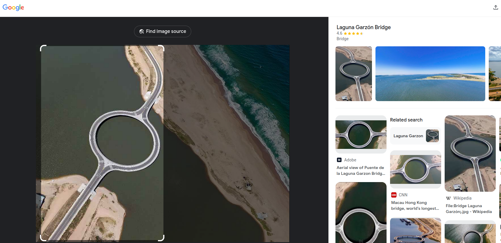

# Round Bridge

## Description

I remember visiting this stunning coastal location with an unusual circular bridge, but I can’t seem to recall its name. Can you help me figure out where this place !

PS : Put the name of this place in the flag format FLAG{*}, all in lowercase, and replace spaces with _. FLAG: FLAG{big_round_bridge}

Skills: Geo-Intelligence

### Steps to complete

- Download and unzipped. Only a single image in the file
- 
- Reverse image search
  - 
  - Laguna Garzón Bridge

#### `FLAG{laguna_garzon_bridge}`
