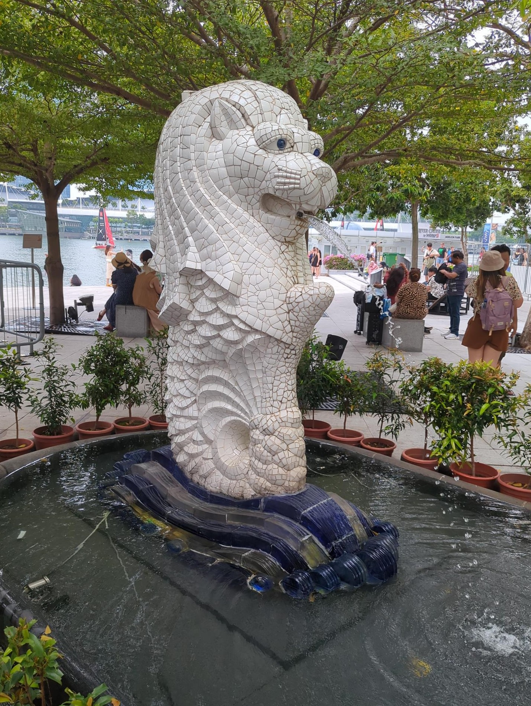
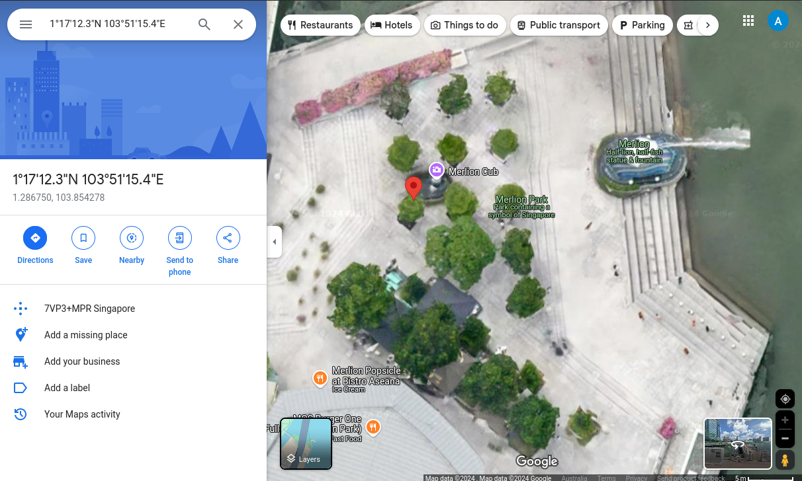

# The Waters Den

## Description

A traveler left behind more than just footprints at a not so forgotten place. A single photo was all they shared, but within it lies a hidden trail—one that can lead you to where they once stood. Look beyond what the eye can see, and you might just uncover the secrets buried in the data.

Flag Format: FLAG{StatueName}

Skills: Geo-Intelligence

### Steps to complete

- Download and unzip. Single file again.
- 
- Reverse image search doesn't work for this one.
  - See the same image (Merlion) but the flag isn't accepted.
- "...buried in the data"
- Encoded data (encoding vs encryption)
  - `MbAxNycxMi4zIk4gMTAzsDUxJzE1LjQiRQ==`
  - Many ways to decode, but the most illustrative is cyberchef
    - Created by GCHQ and released to the public. A fantastic tool for data manipulation and cybersecurity forensic investigations ... oh and CTFs.
- Decode using cyberchef
  - 
  - `1°17'12.3"N 103°51'15.4"E`
- Google maps and a pin is dropped next to a statue called Merlion Cub
  - 

#### `FLAG{MerlionCub}`
